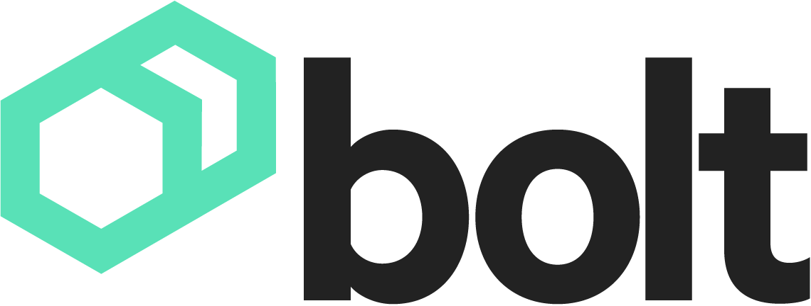

# Welcome to Bolt

Bolt is an open source orchestration tool that automates the manual work it takes to maintain your infrastructure. Use Bolt to automate tasks that you perform on an as-needed basis or as part of a greater orchestration workflow. For example, you can use Bolt to patch and update systems, troubleshoot servers, deploy applications, or stop and restart services. Bolt can be installed on your local workstation and connects directly to remote nodes with SSH or WinRM, so you are not required to install any agent software.

|Helpful Bolt docs links|Other useful places|
|-----------------------|-------------------|
|-   **Before you install**

[Release notes](bolt_release_notes.md) - What's new, what's removed, what's resolved.

 -   **Install Bolt**

[Installing Bolt](bolt_installing.md#) - Follow the installation instructions for your operating system: \*nix, macOS, or Windows.

 -   **Make one-time changes to your remote nodes**

[Run a command](running_bolt_commands.md#)

[Run a script](running_bolt_commands.md#)

[Upload files](running_bolt_commands.md#)

 -   **Automate your workflow with existing tasks and plans**

[Running tasks](bolt_running_tasks.md#)

[Running plans](bolt_running_plans.md#)

 -   **Create your own tasks and plans**

[Writing tasks](writing_tasks.md#)

[Writing plans in Puppet language](writing_plans.md#)

[Writing plans in YAML](writing_yaml_plans.md#)

[Example plans](writing_plans.md#)

[Applying manifest blocks](applying_manifest_blocks.md#)

|-   **Learn the basics**

[Hands-on lab](https://puppetlabs.github.io/bolt/) - Using a GitHub repository with sample files and code examples, install and run Bolt in a safe environment.

[Online training](https://learn.puppet.com/course/puppet-orchestration-bolt-and-tasks?_ga=2.158319738.1526297716.1533055277-261802629.1531434605) - Learn how to use Bolt to run a command, a script, and a task.

 -   **Watch Bolt development**

[Bolt project on GitHub](https://github.com/puppetlabs/bolt)

 -   **Docs for related Puppet products**

[Open source Puppet](https://puppet.com/docs/puppet/latest/index.html)

[Puppet Enterprise](https://puppet.com/docs/pe/latest/pe_user_guide.html)

[Puppet Development Kit](https://puppet.com/docs/pdk/latest/pdk.html)

 -   **Why and how people are using Bolt**

[Product Spotlight Webinar: Puppet Tasks](https://puppet.com/resources/webinar/product-spotlight-webinar-puppet-taskstm)

[Combining PowerShell, Bolt and Puppet Tasks](https://puppet.com/blog/combining-powershell-bolt-and-puppet-tasks-part-1)

 -   **Share and contribute**

[Join us on Slack](https://slack.puppet.com/) - Join the \#bolt channel.

[Follow us on Twitter](https://twitter.com/puppetize/)

[Engage with the Puppet community](https://puppet.com/community) - Share what you know and get help from other users and employees.

[Puppet Forge](https://forge.puppet.com) - Find modules you can use, and contribute modules you've made to the community.

[Open source projects from Puppet on GitHub](https://github.com/puppetlabs/)

|

To send us feedback or let us know about a docs error, [open a ticket](https://tickets.puppetlabs.com/browse/DOCUMENT/?selectedTab=com.atlassian.jira.jira-projects-plugin:summary-panel) \(you'll need a Jira account\) or [email the docs team](mailto:docs@puppet.com).

